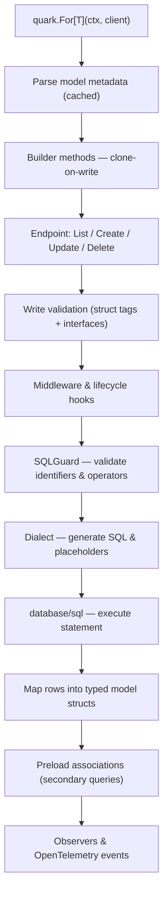

# Architecture

QUARK is organized around a small set of primitives:

- `Client` owns the database handle, dialect, middleware, observers, cache, and
  migration helpers.
- `Query[T]` is the immutable typed builder for model operations.
- `Dialect` isolates database-specific SQL details.
- Middleware and hooks extend the execution path.
- `TenantRouter` injects tenant-aware behavior.

## Core principles

| Principle | Implementation |
| --- | --- |
| Type safety | `For[T]` returns a query bound to a concrete model type. |
| Immutability | Query methods clone builder state before returning the next query. |
| Database independence | Dialects own placeholders, quoting, upserts, and DDL. |
| Guarded SQL | SQLGuard validates identifiers, operators, and keywords. |
| Modular execution | Middleware, hooks, observers, and cache stores are injected through the client. |

## Request lifecycle



1. `quark.For[T]` parses model metadata and initializes a typed builder.
2. Builder methods add query state by returning cloned builders.
3. An endpoint such as `List`, `Create`, `Update`, or `Delete` executes.
4. Write operations run validation.
5. Middleware and lifecycle hooks wrap the operation.
6. SQL is generated through the dialect and SQLGuard.
7. `database/sql` executes the statement.
8. Rows are mapped into typed models.
9. Preloads resolve associations with secondary queries.
10. Observers and telemetry receive query events.

## Native routines and events

QUARK separates routine execution from normal model queries.

```go
users, err := quark.NewRoutine[User](
    ctx,
    client,
    "get_active_users",
    100,
).List()
```

For stored procedures with output parameters, use `Call`.

```go
var processed int
err := quark.Call(
    ctx,
    client,
    "process_billing",
    "2026-05",
    sql.Out{Dest: &processed},
)
```

Database-native events are exposed through notification helpers such as
`quark.Notify`.

## Schema evolution

Schema operations are routed through dialect methods for add, drop, alter,
rename column, and rename table behavior. Dialects also report whether
transactional DDL is supported.
